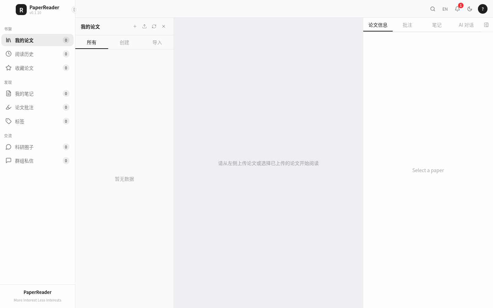
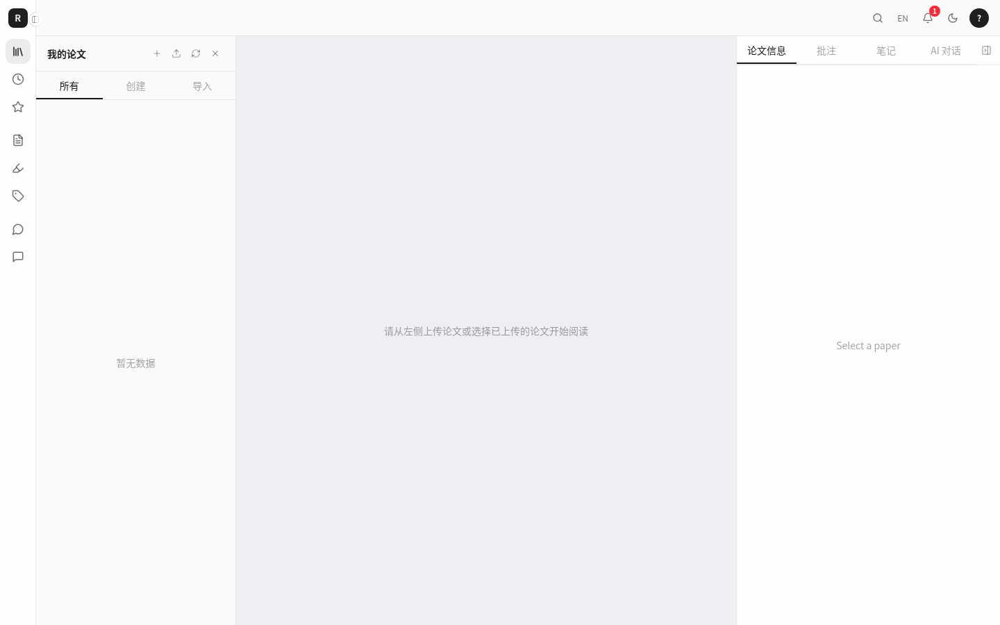
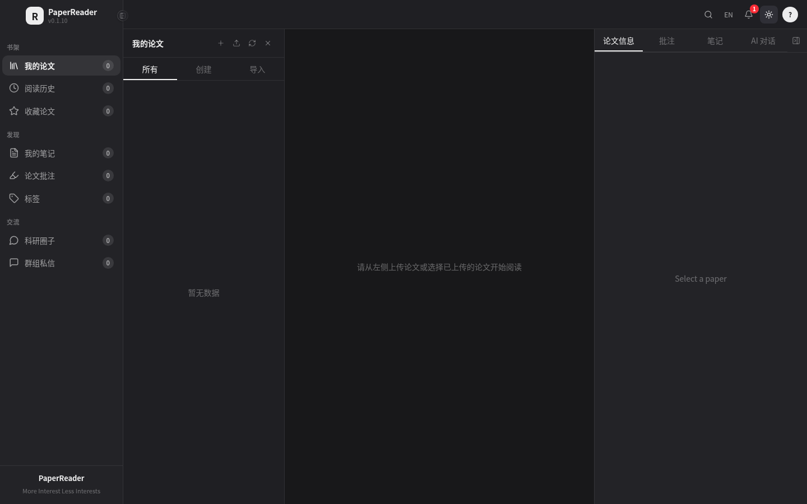

# PaperHelper

PaperHelper is an academic paper reading workspace. It combines a Next.js client, a Kotlin/Spring Boot API, PDF storage, GROBID metadata extraction, annotations, notes, AI-assisted reading, research discussions, and private messaging.

The repository contains the C-side product and its API. The administration console is maintained separately in the companion project at `/root/paperread-admin`; it uses the same PostgreSQL instance but keeps administrator data in the `paperread_admin` schema.

> **Maintainer start here:** read the [documentation index](docs/README.md), then the [new maintainer guide](docs/NEW_MAINTAINER_GUIDE.md) and [complete project status](docs/PROJECT_STATUS.md). They record the real production topology, configuration rules, known risks, and release workflow without requiring previous chat context.

## Current Iteration: v0.1.34

- Branch: `feature/v0.1.34`
- Scope: correct the v0.1.33 equal-height direction on the login page — the sign-in card keeps its natural height and the left carousel panel stretches to match it.
- Status: deployed to production and verified on 2026-09-08 UTC.

## Current Release

- Default branch: `main`
- Integration branch: `dev`
- Released version branch: `feature/v0.1.34` (released to production)
- Client version: `0.1.34`
- Production version: `0.1.34` (verified 2026-09-08 UTC)
- Default locale: Chinese (`zh`)
- Supported locales: Chinese (`zh`) and English (`en`)
- Production client: `https://paper.pilo.eu.cc`

## Product Preview

The current client layout keeps the brand centered in the left navigation header, places the collapse control on the sidebar boundary, and centers the original English footer copy. The single-letter `H` mark and browser favicon use high-contrast light/dark variants.







The browser icon assets are [paperhelper-favicon-light.svg](frontend/public/paperhelper-favicon-light.svg) and [paperhelper-favicon-dark.svg](frontend/public/paperhelper-favicon-dark.svg). The client updates the active favicon when the selected theme changes.

AI Provider requests use the OpenAI-compatible `/models` and
`/chat/completions` endpoints. The client first tries the configured Provider
directly and, when browser CORS or another network policy prevents access,
retries through the authenticated PaperHelper relay. The relay only accepts
HTTPS public targets, supports the standard `/v1` path correction, does not
persist API keys, and is available only to authenticated users.

## Architecture

```text
Browser
  |
  | HTTPS / WebSocket
  v
Cloudflare proxy
  |
  v
Apache virtual host: paper.pilo.eu.cc
  |-- /api  ->  Spring Boot API :8080
  |-- /ws   ->  Spring WebSocket :8080/ws
  `-- /     ->  Next.js client :3001

Spring Boot API :8080
  |-- PostgreSQL 16 :5432
  |-- Redis 7 :6379
  |-- Local filesystem or Dufs storage
  `-- GROBID :8070
```

The production domain is not a Cloudflare Pages deployment. Cloudflare provides DNS/proxy and TLS at the edge; Apache on the server routes requests to the local PM2-managed processes. This distinction matters when deploying: rebuilding the client and restarting PM2 is required for a source change to reach the domain.

## Repository Layout

```text
paper-reader/
|-- frontend/                 Next.js C-side client
|   |-- public/               favicon and static assets
|   |-- src/app/              routes, locale layouts, middleware
|   |-- src/components/       reader, papers, notes, chat, forum, layout
|   |-- src/lib/api/           typed API clients and DTOs
|   |-- src/stores/            Zustand application stores
|   `-- package.json
|-- backend/                  Kotlin/Spring Boot API
|   |-- src/main/kotlin/       controllers, services, models, security
|   |-- src/main/resources/    application config and Flyway migrations
|   |-- docker-compose.yml     isolated/new-environment infrastructure template
|   `-- build.gradle.kts
|-- docs/                     deployment and technical documents
`-- ui-demo.html               standalone early UI exploration
```

## Main Capabilities

### Paper workspace

- Upload PDF files, import papers from a URL, or create paper metadata manually.
- Browse papers by library, source type, reading history, tags, and favorites.
- View paper metadata, abstract, authors, DOI, publication details, extra fields, and GROBID output.
- From the Reader metadata panel, resolve exact arXiv IDs and DOIs through arXiv, DataCite, and Crossref, preview field-level candidates, and apply only selected values.
- Metadata enrichment records source URLs, confidence, conflicts, short-lived previews, and applied-field provenance. The v0.1.23 implementation is deployed to production and supports the documented single-paper flow.
- Edit paper metadata, favorite papers, add/remove tags, generate share text, download PDFs, and delete papers.
- Create and browse paper version records. External GitHub/Gitee/OSS/S3 artifact pushing is still a placeholder and must not be presented as complete.

### Reading and research

- PDF rendering with page navigation, zoom, text search, and reading progress.
- Highlight, underline, strikethrough, and note annotations with page/text anchors.
- Annotation comments and editable notes with Markdown and image support.
- AI chat for paper questions, summaries, explanations, and translation when a model is configured.
- The reader AI panel supports direct OpenAI-compatible Providers, a Provider warning/configuration path, browser-persisted conversation history, an icon-only new-chat action, and in-composer Provider/model selectors.
- Each local conversation stores its own Provider and model. A new conversation inherits the previous conversation's selection, while returning to an existing conversation restores its original selection.
- User messages use the signed-in user's avatar, assistant messages are labeled `PR助手`, and the first conversation title is generated from the user/assistant exchange rather than copied from the question.
- History entries show both creation time and the time of the latest conversation. A response waiting in one conversation does not block sending in another conversation.
- Direct Provider chat validates displayable response text. It supports common OpenAI, Responses API, Gemini, DashScope, Spark, AI SDK data-stream, NDJSON, wrapped and semantically named response fields. If a successful streaming response contains no readable text, the client makes one `stream: false` compatibility retry before showing a value-free response-structure diagnostic.
- Research forum, topics, posts, comments, likes, favorites, follows, private messages, and groups.
- Notification center, release feature popup, language switching, and light/dark themes.

### Authentication

- Email/password login.
- Email verification-code login API; the current implementation writes codes to the backend log and does not yet deliver real email.
- GitHub OAuth callback flow.
- Short-lived access token plus refresh token stored by the client session store.
- Middleware route guard based on the `pr_session` cookie.

## Technology Stack

| Layer | Technology |
| --- | --- |
| Client | Next.js 15, React 19, TypeScript, Tailwind CSS 4 |
| Client state | Zustand with persisted session/preferences stores |
| Client UI | Radix primitives, Lucide icons, custom CSS variables |
| PDF and editor | `react-pdf`, `pdfjs-dist`, TipTap, React Markdown, remark-gfm |
| API | Kotlin 2.1, Spring Boot 3.4, Spring Security, Spring Data JPA |
| Database | PostgreSQL 16 with Flyway migrations |
| Cache/session support | Redis 7 |
| File storage | Dufs or local filesystem |
| Metadata and full-text parsing | GROBID 0.8.1 |
| Realtime | Spring WebSocket/STOMP |
| Runtime | PM2, Apache, Cloudflare proxy |

## Requirements

For an isolated full-stack development environment:

- Node.js 22 or a compatible current LTS release.
- pnpm 11 for the checked-in client lockfile.
- JDK 17 for the Spring Boot API.
- Docker and Docker Compose for PostgreSQL, Redis, Dufs, and GROBID.
- At least one AI provider key if AI chat is required.
- A future mail-service integration if real email-code delivery is required; SMTP delivery is not implemented yet.

## Configuration

Copy the examples and fill in environment-specific values. Do not put production secrets in source control.

### Client: `frontend/.env.local`

```dotenv
NEXT_PUBLIC_API_URL=http://localhost:8080/api
NEXT_PUBLIC_WS_URL=ws://localhost:8080/ws
NEXT_PUBLIC_AUTH_ENABLED=true
NEXT_PUBLIC_GITHUB_CLIENT_ID=
NEXT_PUBLIC_GITHUB_REDIRECT_URI=http://localhost:3001/callback
NEXT_PUBLIC_ENABLE_AI_CHAT=true
```

For the production domain, use:

```dotenv
NEXT_PUBLIC_API_URL=https://paper.pilo.eu.cc/api
NEXT_PUBLIC_WS_URL=wss://paper.pilo.eu.cc/ws
NEXT_PUBLIC_GITHUB_REDIRECT_URI=https://paper.pilo.eu.cc/callback
```

### API: `backend/.env`

The complete template is in [backend/.env.example](backend/.env.example). The important groups are:

| Group | Variables | Purpose |
| --- | --- | --- |
| Application | `SPRING_PROFILES_ACTIVE`, `SERVER_ADDRESS`, `SERVER_PORT`, `LOG_LEVEL` | Runtime profile, bind address, and port |
| PostgreSQL | `DATABASE_HOST`, `DATABASE_PORT`, `DATABASE_NAME`, `DATABASE_USER`, `DATABASE_PASSWORD` | Main relational database |
| Redis | `REDIS_HOST`, `REDIS_PORT`, `REDIS_PASSWORD` | Cache and session support |
| JWT | `JWT_SECRET`, `JWT_ACCESS_EXPIRATION`, `JWT_REFRESH_EXPIRATION` | Token signing and TTL |
| Storage | `STORAGE_TYPE`, `STORAGE_LOCAL_PATH`, `DUFS_URL` | PDF and artifact storage |
| Parsing | `GROBID_BASE_URL`, `GROBID_TIMEOUT` | GROBID integration |
| Login | `MAIL_FROM`, `GITHUB_CLIENT_ID`, `GITHUB_CLIENT_SECRET` | Email and GitHub auth |
| AI | `OPENAI_*`, `CLAUDE_*`, `DEEPSEEK_*`, `QWEN_*` | Optional model providers |

`JWT_SECRET` must be a strong production secret. Redis is configured with password protection in the Compose file; keep the same `REDIS_PASSWORD` in the backend environment and Docker environment.

## Local Development

### 1. Start infrastructure (isolated development hosts only)

Do **not** run this on the current production host. Production already uses external/shared containers that are not managed by this Compose project; starting the repository stack there can create port and data-volume conflicts. See [docs/DEPLOY.md](docs/DEPLOY.md).

```bash
cd backend
export REDIS_PASSWORD='replace-with-a-local-random-password'
docker compose up -d
docker compose ps
```

The development template's default host ports are PostgreSQL `5432`, Redis `6379`, Dufs `8400`, and GROBID `8070`. GROBID may need a short warm-up period before PDF parsing is ready. Current production instead uses local storage at `/root/paper-reader/backend/uploads` and has no Dufs container.

### 2. Start the API

```bash
cd backend
set -a
. ./.env
set +a
./gradlew bootRun
```

The API listens on `http://localhost:8080`. Health check:

```bash
curl http://localhost:8080/api/health
```

### 3. Start the client

```bash
cd frontend
pnpm install
pnpm dev
```

Next.js development mode listens on `http://localhost:3000` by default. To use the production port locally, run `pnpm dev -- --hostname 127.0.0.1 --port 3001`. Open `/zh/login` or `/en/login` for the public login routes.

## Build and Test

### Client

```bash
cd frontend
pnpm install --frozen-lockfile
pnpm exec tsc --noEmit
pnpm test
pnpm run build
```

`pnpm run build` compiles the Next.js production bundle, checks TypeScript, runs the configured lint checks, and generates `.next/`. Existing lint warnings do not fail the current build; new warnings should still be reviewed.

### API

```bash
cd backend
./gradlew test
./gradlew bootJar -x test
```

The API artifact is written to `backend/build/libs/`.

## Production Deployment

The current server uses PM2. Build before restarting so the process loads the new `.next` output.

### Client-only change

```bash
cd /root/paper-reader/frontend
pnpm install --frozen-lockfile
pnpm run build
pm2 restart paper-reader-frontend --update-env
pm2 save
```

### API change

```bash
cd /root/paper-reader/backend
./gradlew clean test bootJar
BACKEND_VERSION="$(tr -d '\r\n' < VERSION)"
test -f "build/libs/paper-reader-backend-${BACKEND_VERSION}.jar"
set -a
. ./.env
set +a
# `sudo` is not used here: PM2 must receive the exported application variables.
pm2 delete paper-reader-backend
pm2 start --name paper-reader-backend \
  --cwd /root/paper-reader/backend \
  java -- -jar "/root/paper-reader/backend/build/libs/paper-reader-backend-${BACKEND_VERSION}.jar"
curl --fail --retry 10 --retry-connrefused --retry-delay 2 \
  http://127.0.0.1:8080/api/health
pm2 save
```

The backend artifact filename is versioned. A plain `pm2 restart paper-reader-backend` preserves the old JAR argument, so recreate that one PM2 entry whenever the backend version changes and verify the new `script args` afterward. Load `backend/.env` in the same shell immediately before `pm2 start`; a recreated PM2 entry does not inherit application variables from the deleted entry. If startup loops, inspect `pm2 logs paper-reader-backend --lines 100 --nostream` before saving the process list.

### Verify the running deployment

```bash
pm2 status
ss -ltnp | grep -E '3001|8080'
curl -I https://paper.pilo.eu.cc/zh/login
curl https://paper.pilo.eu.cc/api/health
```

Expected services are `paper-reader-frontend` on port `3001` and `paper-reader-backend` on port `8080`. The Apache SSL virtual host is stored outside this repository at `/etc/apache2/sites-available/paper.pilo.eu.cc-ssl.conf`; its `/api` and `/ws` routes go to the API and its remaining routes go to Next.js.

Do not use a Cloudflare Pages deployment command for this server. The production request path is Cloudflare proxy -> Apache -> PM2 -> Next.js/Spring Boot.

## Database Migrations

API migrations are applied by Flyway at startup. They are located in [backend/src/main/resources/db/migration](backend/src/main/resources/db/migration) and currently include:

```text
V1__init.sql
V2__oauth_email_login.sql
V3__create_paper.sql
V4__paper_category_version_storage.sql
V5__paper_favorite_tags.sql
V6__audit_log.sql
V7__forum.sql
V8__im.sql
V9__annotation_note_enhance.sql
V10__note_position.sql
V11__paper_content_context.sql
V12__clean_known_paper_title_boilerplate.sql
```

Add a new numbered migration for schema or controlled data changes. Do not edit an already-applied migration in a shared environment. V12 narrowly repairs stored titles beginning with one explicitly recognized Google permission statement; future imports use the same conservative cleanup in the TEI parser.

## API Surface

All business API routes are under `/api` and require the client token unless explicitly documented as public.

| Area | Base path |
| --- | --- |
| Health | `/api/health` |
| Authentication | `/api/auth` |
| Papers and PDFs | `/api/papers` |
| Paper question context | `/api/papers/{paperId}/context` |
| GROBID | `/api/papers/{paperId}/grobid` |
| Versions | `/api/papers/{paperId}/versions` |
| Reading history | `/api/reading-logs` |
| Notes | `/api/notes` |
| Annotations and comments | `/api/annotations` |
| AI chats | `/api/ai-chats` |
| Forum | `/api/forum` |
| Messages and groups | `/api/chat` |
| Storage configurations | `/api/storage-configs` |
| User settings | `/api/settings` |
| Audit log | `/api/audit-logs` |
| WebSocket/STOMP | `/ws` |

The frontend API wrapper is in [frontend/src/lib/api](frontend/src/lib/api), and DTO contracts are centralized in [frontend/src/lib/api/types.ts](frontend/src/lib/api/types.ts).

## UI Conventions

- The product brand is `PaperHelper`; the compact mark is a single uppercase `H`.
- The left sidebar uses a centered brand header and centered footer copy: `PaperHelper` and `More Interest Less Interests`.
- The collapse button is positioned on the sidebar boundary so it does not push the brand when the sidebar is expanded.
- Favicon and logo colors remain grayscale and follow the selected light/dark theme.
- Preferences are available from the avatar menu between Profile and Log Out.
- In the AI chat panel, an unconfigured Provider is shown as a warning. The warning and the composer’s Provider action open Preferences directly on the AI configuration tab. The model selector stays unavailable until a Provider is active.
- Direct Provider conversations are stored in the browser under the `pr-ai-direct-chats` Zustand store. They are separate from the backend `/api/ai-chats` records because they use the user-selected Provider; the Provider API key is sent to PaperHelper only when the authenticated relay is needed after a browser network/CORS failure.
- Provider relay endpoints are `/api/provider-relay/models` and `/api/provider-relay/chat/completions`; they forward only the current operation and never log the supplied Provider key.
- AI replies separate `<think>`/reasoning content into a default-collapsed disclosure. PDF selection can open the AI panel with the selected quote, paper metadata, and relevant GROBID-extracted passages as hidden context.
- Uploaded PDFs are parsed asynchronously through GROBID `/api/processFulltextDocument`; parsing status and failures are visible without blocking PDF reading.
- GROBID metadata titles pass through a conservative PaperHelper-side cleanup for explicitly recognized publisher permission boilerplate; ordinary long titles are never truncated by length heuristics.
- `/api/health` reads the backend version from Spring Boot build metadata, so the reported release always follows the JAR being executed instead of a controller constant.
- Paper cards reserve a dedicated action area beside the category badge. Their delete action uses a confirmation dialog and lets users choose whether the server should also remove the stored original file.
- The current-paper card uses a short inset capsule, a low-contrast border, and theme-specific layered highlights/shadows instead of a heavy full-height black edge.
- Source UI copy is localized under `frontend/src/i18n/locales/{zh,en}/common.json`.

## Versioned Development

The project uses a release-style branch and client version for every code iteration:

- `main` is the repository default and production branch; `dev` is the integration branch.
- Start every iteration from the latest remote release baseline: new requirements use the next `feature/vX.Y.Z` branch; bugs from a released version use that version's `feature/vX.Y.Z-fix` branch. Do not stack work on a stale iteration branch.
- After type checks, tests, and production builds pass on the iteration branch, commit and push immediately; merge to `dev`, validate, then merge to `main`. Do not bypass `dev` or develop directly on `main`.
- After merging `main`, perform a real production deployment through PM2/Apache, verify locally and through the public domain, and only then run `pm2 save`; development servers are not production deployment.
- Ordinary maintenance or feature work increments the patch number: `0.1.10` → `0.1.11` → `0.1.12`.
- Bug-fix iterations append `-fix` to the repaired version, for example `0.1.12-fix`, with a matching branch such as `feature/v0.1.12-fix`.
- A minor release (`0.1.x` → `0.2.0`) or major release (`0.x.y` → `1.0.0`) is created only when the product owner explicitly requests it.
- Keep every version branch after merging; it is part of the release and rollback history.
- Keep the current release branch (`feature/v0.1.32`), `frontend/package.json`, `frontend/VERSION`, `backend/VERSION`, README release line, favicon cache-busting value, and visible UI version aligned. Production is `0.1.32`; future work starts from the latest `dev`.
- Every code iteration must be built, tested, deployed to the PM2 process, verified through the public domain, committed, and pushed to the matching remote branch.

The documentation map is in [docs/README.md](docs/README.md). New maintainers should start with [docs/NEW_MAINTAINER_GUIDE.md](docs/NEW_MAINTAINER_GUIDE.md) and [docs/PROJECT_STATUS.md](docs/PROJECT_STATUS.md). Detailed operating rules are in [docs/MAINTENANCE.md](docs/MAINTENANCE.md), the roadmap is in [docs/PLAN.md](docs/PLAN.md), cautions are in [docs/ATTENTION.md](docs/ATTENTION.md), and AI design is in [docs/AI_CHAT_TECHNICAL_SOLUTION.md](docs/AI_CHAT_TECHNICAL_SOLUTION.md).

## Troubleshooting

### The domain shows an old interface

Confirm the source was built and the production process restarted:

```bash
cd /root/paper-reader/frontend
pnpm run build
pm2 restart paper-reader-frontend --update-env
pm2 save
curl -I https://paper.pilo.eu.cc/zh/login
```

Also check `cf-cache-status`. HTML is configured as dynamic/no-cache by Next.js; static assets may be revalidated by Cloudflare. The versioned favicon query string helps avoid stale browser icon entries.

### Port 3001 is unavailable

```bash
pm2 show paper-reader-frontend
ss -ltnp | grep 3001
pm2 logs paper-reader-frontend --lines 100 --nostream
```

Do not kill a broad process set. Resolve the exact process using PM2 and the port owner before changing anything.

### API calls fail from the browser

Check the client `NEXT_PUBLIC_API_URL`, API health, Apache `/api` proxying, and browser Network errors in that order. A successful Next.js page response does not prove the Spring Boot API is healthy.

### PDF metadata is missing

Check GROBID independently:

```bash
curl http://localhost:8070/api/isalive
docker ps --filter name=paper-reader-grobid
```

GROBID is only required for parsing/import enrichment; already stored PDFs can still be served when parsing is unavailable.

### Redis fails at startup

Make sure the Compose environment provides `REDIS_PASSWORD` and the backend `.env` uses the same value. The current Compose file intentionally refuses to start Redis without an explicit password.

## Further Documentation

- [Documentation index](docs/README.md)
- [New maintainer guide](docs/NEW_MAINTAINER_GUIDE.md)
- [Complete project status](docs/PROJECT_STATUS.md)
- [Deployment guide](docs/DEPLOY.md)
- [PDF rendering pipeline](docs/PDF_RENDERING_PIPELINE.md)
- [Create paper feature](docs/CREATE_PAPER_FEATURE.md)
- [Share dialog and tab bug fix](docs/BUGFIX_TAB_SHARE_TOAST.md)
- [Companion administration console](../paperread-admin/README.md) when both projects are checked out under `/root`

## License and Project Status

This repository is an active private project. Confirm deployment credentials, storage policy, and user-data handling before exposing a new environment publicly.
